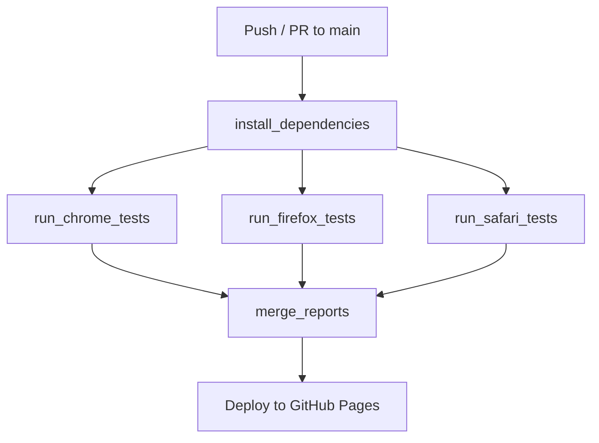

# 🚀 Bah.Ai Test Automation Suite


[](https://rlongcop-agsx.github.io/bah.ai-automation/)

This automation framework provides comprehensive cross-browser testing for the Bah.Ai project using Robot Framework.

## 🌟 Key Features
- **Multi-browser testing** (Chrome, Firefox, Safari)
- **Real-time dashboard** with visual analytics
- **Automated reporting** with historical data
- **CI/CD integration** with GitHub Actions
- **Quality gates** with pass/fail thresholds

## 📊 Test Reports Dashboard

🔗 [Live Test Dashboard](https://rlongcop-agsx.github.io/bah.ai-automation/)

| Browser | Report | Logs |
|---------|--------|------|
| Chrome | [Report](https://rlongcop-agsx.github.io/bah.ai-automation/browser-reports/chrome/report.html) | [Logs](https://rlongcop-agsx.github.io/bah.ai-automation/browser-reports/chrome/log.html) |
| Firefox | [Report](https://rlongcop-agsx.github.io/bah.ai-automation/browser-reports/firefox/report.html) | [Logs](https://rlongcop-agsx.github.io/bah.ai-automation/browser-reports/firefox/log.html) |
| Safari | [Report](https://rlongcop-agsx.github.io/bah.ai-automation/browser-reports/safari/report.html) | [Logs](https://rlongcop-agsx.github.io/bah.ai-automation/browser-reports/safari/log.html) |

## 🛠️ Technical Stack
- **Test Framework**: Robot Framework
- **Browser Automation**: Selenium Library
- **CI/CD**: GitHub Actions
- **Reporting**: Custom HTML Dashboard
- **Visualization**: GitHub Pages

## 📈 Test Coverage
```text
✅ Regression Tests: 100% coverage
✅ Smoke Tests: Critical path coverage
✅ Cross-Browser: Chrome, Firefox, Safari
```

## 🏗️ Project Structure

```text
bah.ai-automation/
├── tests/               # Test cases
├── resources/           # Shared resources
├── results/             # CI output
│   └── browser-reports/ # Browser-specific reports
├── .github/workflows/   # CI pipelines
└── index.html           # Dashboard
```

## 🔄 CI/CD Pipeline


